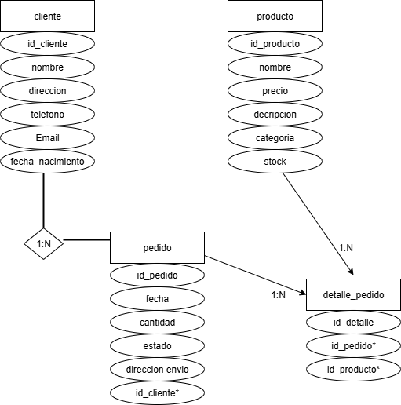
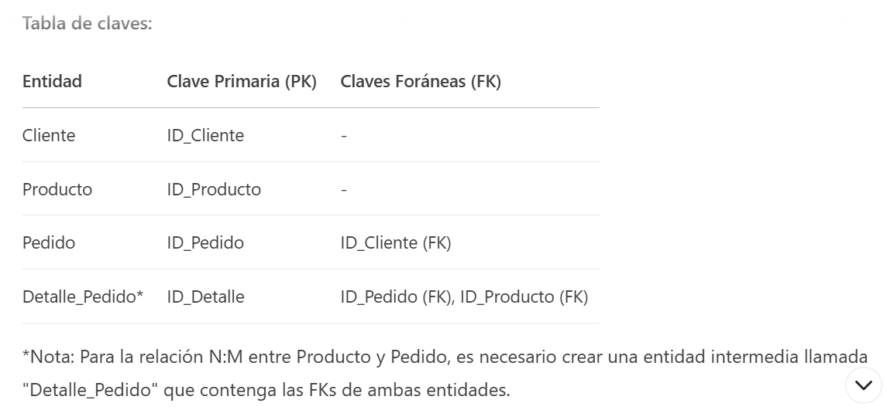

# ✏️ Actividad Práctica: "Crea tu Primer Diagrama ER"

Antes de aprender conceptos avanzados de bases de datos, realizaremos una actividad sencilla para **visualizar entidades, atributos y relaciones**.

## **Instrucciones:**

1. Ingresa a [Draw.io](https://app.diagrams.net/) y crea un nuevo diagrama en blanco.
2. Dibuja **3 entidades (rectángulos)** con los nombres:
   - **Cliente**
   - **Producto**
   - **Pedido**
3. Agrega **mínimo 6 atributos** a cada entidad (óvalos conectados).  
   **Ejemplo:**
   - **Cliente:** Rut, Nombre, Dirección.
   - **Producto:** Código, Nombre, Precio.
   - **Pedido:** Código, Fecha, Cantidad.
4. Conecta las entidades con **rombos** que representen las relaciones:
   - Cliente ↔ Pedido
   - Producto ↔ Pedido
5. No es necesario definir cardinalidades por ahora, solo entender cómo se conectan.
6. Exporta tu diagrama como **imagen PNG** para entregarlo.

**Respuesta**


Relaciones (rombos):
Cliente "realiza" Pedido (1:N)
Producto "está_en" Pedido (N:M)


# 🔍 Actividad 2: Investiga y Aplica la Cardinalidad

Ahora que ya tienes tu primer diagrama ER, es momento de aprender sobre **cardinalidad**.

## **Instrucciones:**

1. Investiga qué es la **cardinalidad** en un modelo ER:
   - ¿Qué significan 1:1, 1:N y N:M?
   - ¿Por qué es importante definirla en una base de datos?
2. Agrega **cardinalidades** a tu diagrama de la Actividad 1.  
   **Ejemplo:**
   - **Un cliente** puede realizar **muchos pedidos** (1:N).
   - **Un pedido** puede incluir **muchos productos** y un producto puede estar en **muchos pedidos** (N:M).
3. Exporta el nuevo diagrama con cardinalidades como **imagen PNG**.

**Respuesta**

1. Relación Uno a Uno (1:1)
Definición: Un registro de la entidad A se relaciona con exactamente un registro de la entidad B, y viceversa.

Ejemplo práctico:

Persona ↔ DNI (cada persona tiene un único DNI y cada DNI pertenece a una única persona)

Implementación en BD:

```sql
CREATE TABLE Persona (
    id_persona INT PRIMARY KEY,
    nombre VARCHAR(100),
    id_dni INT UNIQUE,  -- Clave foránea con UNIQUE
    FOREIGN KEY (id_dni) REFERENCES DNI(id_dni)
);
```

2. Relación Uno a Muchos (1:N)
Definición: Un registro de la entidad A puede relacionarse con varios registros de la entidad B, pero cada registro de B se relaciona con solo uno de A.

Ejemplo clásico:

Departamento ↔ Empleados (un departamento tiene muchos empleados, pero cada empleado pertenece a un solo departamento)

Implementación típica:

```sql
CREATE TABLE Empleado (
    id_empleado INT PRIMARY KEY,
    nombre VARCHAR(100),
    id_departamento INT,  -- FK sin UNIQUE
    FOREIGN KEY (id_departamento) REFERENCES Departamento(id_departamento)
);
```

3. Relación Muchos a Muchos (N:M)
Definición: Un registro de A puede relacionarse con muchos registros de B, y viceversa.

Ejemplo típico:

Estudiantes ↔ Cursos (un estudiante toma muchos cursos y un curso tiene muchos estudiantes)

Implementación requerida:
Se necesita una tabla intermedia (tabla puente o junction table):

```sql
CREATE TABLE Matricula (
    id_estudiante INT,
    id_curso INT,
    fecha_matricula DATE,
    PRIMARY KEY (id_estudiante, id_curso),
    FOREIGN KEY (id_estudiante) REFERENCES Estudiante(id_estudiante),
    FOREIGN KEY (id_curso) REFERENCES Curso(id_curso)
);
```


# 🗝 Actividad 3: Claves Primarias y Foráneas

Es momento de identificar las **claves primarias (PK)** y **claves foráneas (FK)** en tu modelo.

## **Instrucciones:**

1. Investiga:
   - ¿Qué son las **claves primarias (PK)**?
   - ¿Qué son las **claves foráneas (FK)**?
   - ¿Por qué son esenciales para mantener la **integridad referencial** en una base de datos?
2. En tu diagrama, indica con un **subrayado o un asterisco** cuál será la **PK** de cada entidad.
3. Crea una pequeña tabla (en Word, Excel, Markdown o Mermaid) que contenga:
   - **Entidad**
   - **Clave primaria (PK)**
   - **Posibles claves foráneas (FK)**.
4. Adjunta tu tabla junto con el diagrama actualizado.

**Respuesta**



